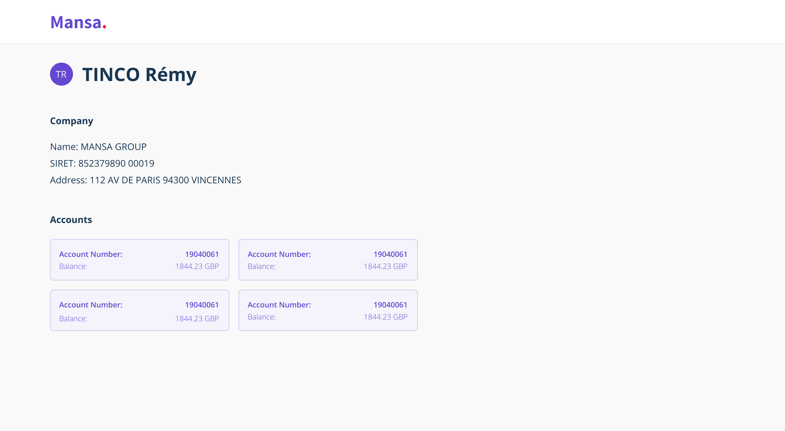

<h1 align="center">Mansa's Kanedama</h1>

Take home test to <b>join us</b> 💜

## Implementation by Adrien Mazet

Deployed app is available [here](https://mansa-take-home-test.vercel.app/)

Stack : TypeScript, React, Next.js, Styled-Components, Jest, React Testing Library (+ React Hooks), Cypress

How long did I take to complete the test ? ~10 hours over 15 days

If I had to do a second iteration I would :

- Mock network calls made on the server side for my E2E tests. Right now they are a bit empty as I don't check that the values received via the API are the ones displayed. I only check that some elements are displayed, with a query on the text content or data-cy attributes.

- Make some components a bit more generic and reusable, and use Storybook to mess with them in isolation.

### Command line

Install dependencies : `npm install`  
Run the app in development mode : `npm run dev`  
Run tests : `npm run test`  
Run E2E tests : `npm run test:e2e:headless`

*It seems that @testing-library/react-hooks does not support React 18 yet. There might be some related errors logged in the console while running tests.*

## The Mission

Your mission, should you accept it, is to create a dashboard-like UI, where we can find:

- User's personal information
  - First & Last name
- User's business information
  - SIRET number
  - Creation date
  - Address (example: 10 Rue Gabriel Peri 92120, Montrouge)
- User's financial information
  - Accounts (TRANSACTION / SAVINGS)
  - Current balance

### Design

Global design to follow can be found below (feel free to improve and/or add your personnal touch - you won't be penalized if not)

|                        User page                        |
| :-----------------------------------------------------: |
|  |

### Scope

The view should only be for **one** single user.

You will need to leverage an open API for business data to fill in the details and functionality as described below.

## Delivery

A clone or fork of this repositery containing:

- An integration of the wireframe above, with the data flow described in this brief
- Some tests (what to test and the types of tests are at your appreciation)
- A README file at the root of your repo explaining 
  - your approach and design choices
  - how long did it take you to complete the test? (you are not evaluated on your rapidity)
  - if you had to do a second iteration, what would you add or improve?

Bonus:

- Deployed app
- Atomic, reusable and stateless base components
- Add a UI interaction of your choice: a button, a dialog, a filter, a second user page, etc. 

Our stack consists of TypeScript, React, [Next.js](https://nextjs.org/), CSS-in-JS with [styled-component](https://styled-components.com/), and we test with Jest and Cypress.

If you're comfortable with it, we encourage you to complete the test in the stack described above. You're also free to use a component library to get you started and any other package that you might think necessary.

We expect you to test your code: unit and end-to-end tests are a big plus. From our experience React Testing Library (on top of Jest) and Cypress work very well for React application testing, but you're free to pick your favourite.

### What We Care About

We're interested in your method and how you approach the problem just as much as we're interested in the end result.

Here's what you should strive for:

- A consistent architecture, focused on the simplicity of the project (**keep it simple!**), pragmatism, no over-engineering
- Extensible code
- Clear data flow (with at least one custom hook for data fetching)
- Fluid layout that would fit on main viewports (from mobile to desktop)
- Concise and clear commit messages
- Complete user information (Profil picture, phone number, etc ...) with
  another API like [randomuser](https://randomuser.me)

## The APIs

### French government API

For business information, you'll have to use the French SIRENE public API,
you can find the documentation about it [here](https://entreprise.data.gouv.fr/api_doc/sirene).

You can retrieve the information about a business by using the following URL:
`https://entreprise.data.gouv.fr/api/sirene/v3/unites_legales/:siren`

> The `unites_legales` object contains all the necessary information.

For example, [here is the API link](https://entreprise.data.gouv.fr/api/sirene/v3/unites_legales/852379890)
that gives you the SIRENE profile of MansaGroup:

You can choose any SIREN (legal id) you want for your test.

### Kanedama API

For financial information, you'll use a custom API:

| Method  | Endpoint  | Description                                |
| ------- | --------- | ------------------------------------------ |
| **GET** | /accounts | Fetch all bank accounts from a _test user_ |

**Root endpoint is: https://kata.getmansa.tech/**

You can see our [Backend test README](../backend/README.md) if you want more information about this endpoint.
